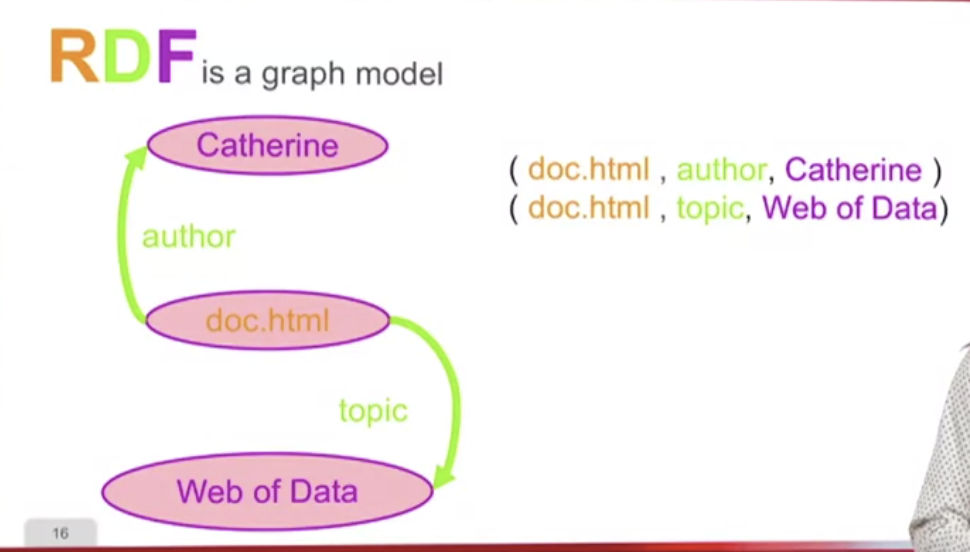
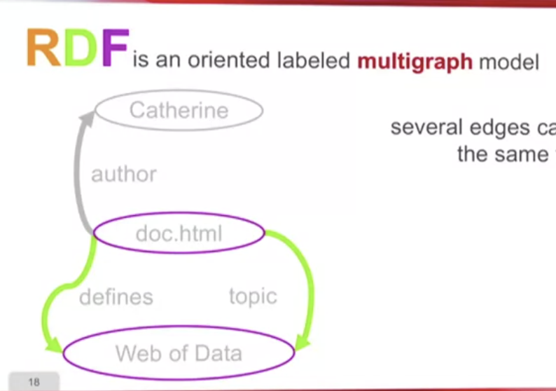
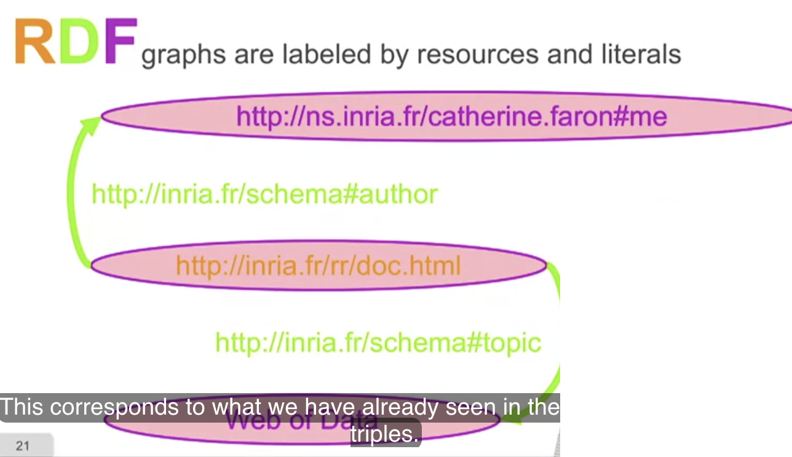
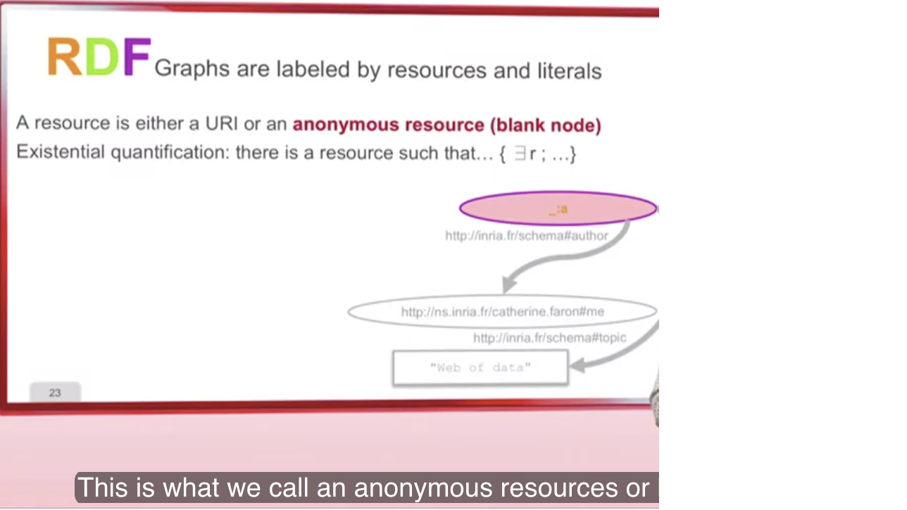
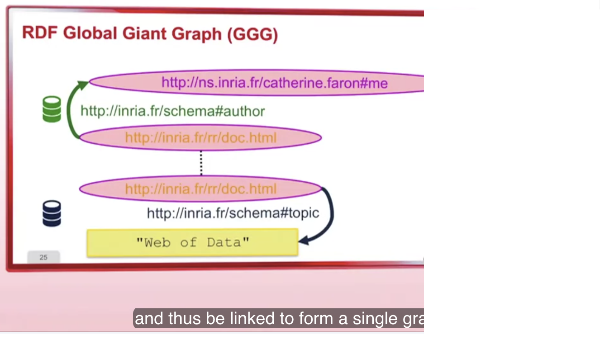
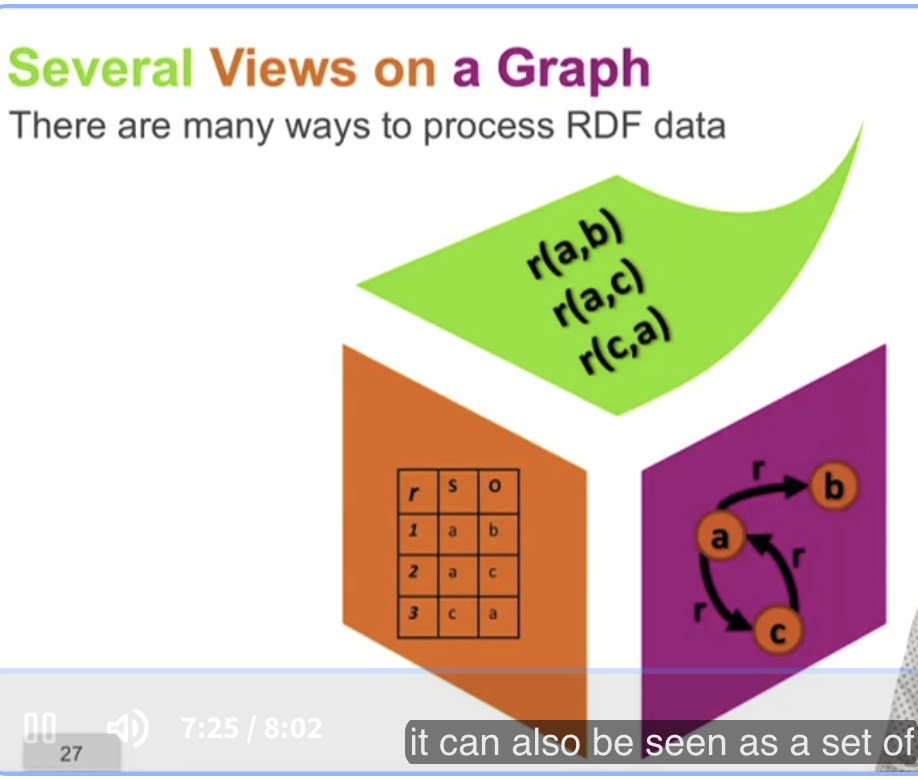

# 2026-09-27 Sunday

## Week 1: Principles of a Web of Linked Data

1. Web architecture
    - 3 components:
        - Identification (URI) & addressing (URL)
        - Communication / protocol (HTTP)
        - Language of representation (HTML)
1. Separating presentation & content
    - CSS
    - XML
        - Namespaces, prefixes, qualified names
1. From pages to resources
    - `*R*` : * "Resource" * 
        - URL: identify what exists on the web 
            - https://website.com
        - URI: identify, on the web, what exists
            - https://website.com/website#this
        - IRI: identify, on the web, in any language, what exists
    - A resource is anything that can be identified by a URI
1. Linked data principles
    - A Web Approach to Data Publication
        - Use HTTP URI (URL) to allow dereferencing the address
        - When a URI is accessed, provide data about the resource it represents (HTTP)
            - "conneg" allows specifying formats on same URI (???)
        - Include in these data links to other data (Web)
    - Importance of Domain Name
        - e.g. ns.inria.fr
            - machines handling answer in order: fr > inria > ns
1. Stack of standards and languages

## Week 2: The RDF Data Model

1. Describing resources
1. A triple model and a graph model
    - RDF
      - **R**esource: pages, chairs, persons, ideas ... ( all that can have a URI )
      - **D**escription: attributes, characteristics, and relations between resources
      - **F**ramework: model, language and syntaxes for these descriptions
    - triples
      - ( subject, predicate, object )
        - subject: always a resource (not literal)
        - predicate: binary property (?)
        - object: value ( resource / literal )
    - graphs
        - 
        - 
        - 
        - 
        - 
        - 
        - > The RDF model is an oriented labeled multi-graph model:

          RDF triples form a graph when getting connected on common 
          subjects or objects. The vertices of an RDF graph are the resources 
          which are the subjects or objects of RDF triples, and its edges are 
          labeled by the properties of the RDF triples. 

          Two resources can be linked by several properties; an RDF graph is therefore a multi-graph.

          Vertices are labeled by URIs or literal values, and edges are labeled by URIs identifying properties.

          Edges are oriented: the tail of an edge is the subject of a triple, and the head of an edge is the object of a triple.
    - open model - extensible vocab
    - RDF global giant graph
    - Readings:
        - https://www.w3.org/TR/rdf11-primer/
        
1. Serialization syntaxes
1. Values, types and languages
1. Groups
1. Naming graphs
1. RDF schemas

