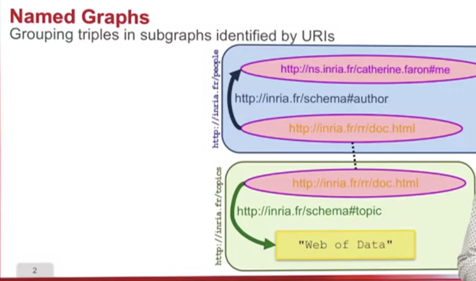
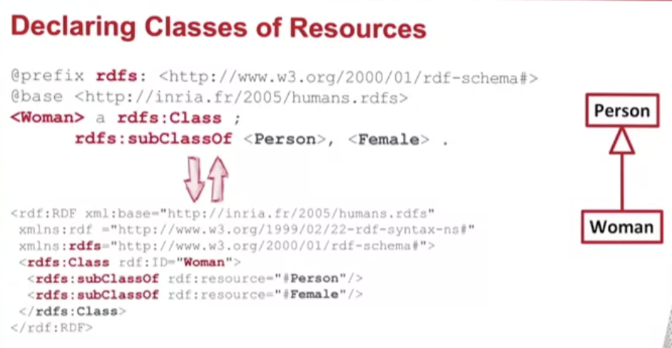
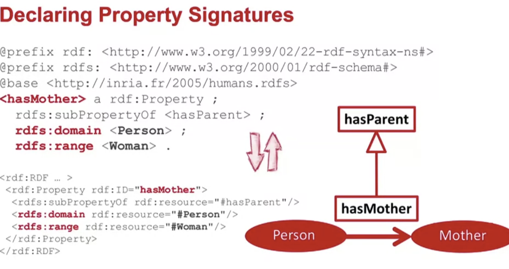
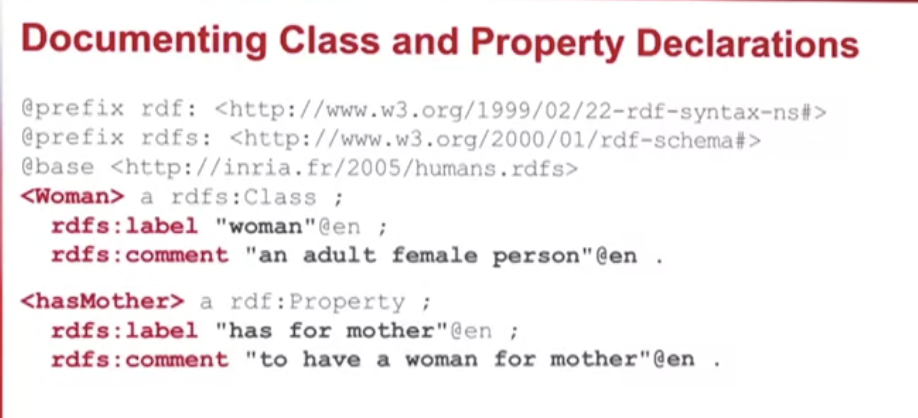
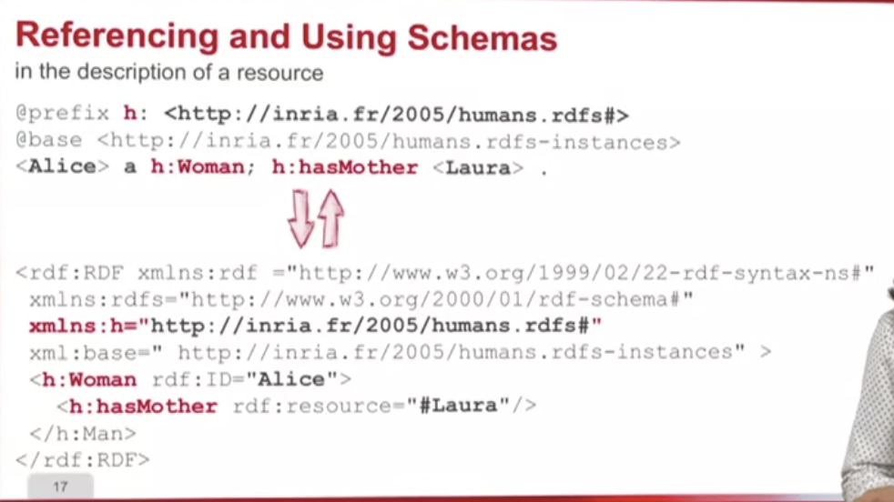
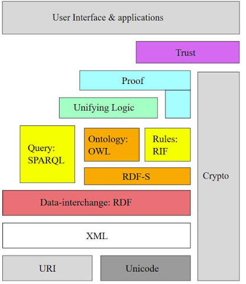
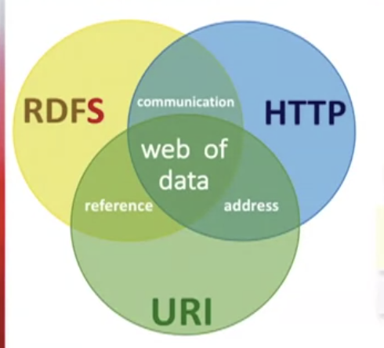

# 2026-09-28

## Week 2

1. Naming graphs
    - 
    - Named graph = a set of triples with an IRI as its name. The name is an IRI, so you can write triples *about* the graph (source, date, ...)
    - Example: graph `ex:g1` holds data from Inria, `ex:g2` data from elsewhere; the default (unnamed) graph holds information about the two graphs
        - **TriG**: `name { ... }` or `GRAPH name { ... }`; triples outside braces go to the default graph
          ```trig
          @prefix ex:  <http://example.org/> .
          @prefix xsd: <http://www.w3.org/2001/XMLSchema#> .

          # default graph: information about the graphs
          ex:g1 ex:source <http://inria.fr> .
          ex:g2 ex:retrieved "2026-09-28"^^xsd:date .

          ex:g1 {
              ex:doc ex:author "Fabien" .
          }

          GRAPH ex:g2 {
              ex:doc ex:title "RDF Primer"@en .
          }
          ```
        - **N-Quads**: graph name = 4th item; 3 items = default graph
          ```nquads
          <http://example.org/g1> <http://example.org/source> <http://inria.fr> .
          <http://example.org/g2> <http://example.org/retrieved> "2026-09-28"^^<http://www.w3.org/2001/XMLSchema#date> .
          <http://example.org/doc> <http://example.org/author> "Fabien" <http://example.org/g1> .
          <http://example.org/doc> <http://example.org/title> "RDF Primer"@en <http://example.org/g2> .
          ```
        - **JSON-LD**: object with `@id` + `@graph` = named graph; its other properties (e.g. `ex:source`) are statements about the graph, in the default graph
          ```json
          {
            "@context": {
              "ex": "http://example.org/",
              "xsd": "http://www.w3.org/2001/XMLSchema#"
            },
            "@graph": [
              {
                "@id": "ex:g1",
                "ex:source": { "@id": "http://inria.fr" },
                "@graph": [
                  { "@id": "ex:doc", "ex:author": "Fabien" }
                ]
              },
              {
                "@id": "ex:g2",
                "ex:retrieved": { "@value": "2026-09-28", "@type": "xsd:date" },
                "@graph": [
                  { "@id": "ex:doc", "ex:title": { "@value": "RDF Primer", "@language": "en" } }
                ]
              }
            ]
          }
          ```
        - **SPARQL** (later in the course): `GRAPH` picks which named graph to match
          ```sparql
          PREFIX ex: <http://example.org/>

          # which graph says who wrote ex:doc, and where did that graph come from?
          SELECT ?g ?author ?src WHERE {
            GRAPH ?g { ex:doc ex:author ?author }
            ?g ex:source ?src .
          }
          ```
            - Result: `ex:g1`, `"Fabien"`, `<http://inria.fr>`. `?g ex:source ?src` is outside `GRAPH`, so it's matched in the default graph (what the default graph contains depends on the endpoint's setup)
    - N-Triples, Turtle and RDF/XML can't name graphs (one graph per file); the usual approach is to use the file's URL as the graph name
1. RDF Schema
    - RDFS
        - naming classes, hierarchies
            - e.g:
                - xml: use xlmns
                - turtle: @prefix (??)
        - 
        - 
        - 
        - 
    - 
    - 

### Advanced Level Exercise

```
@prefix ns0: <http://www.unice.fr/voc#> .

<http://www.unice.fr/data#Margot>
  a <http://www.unice.fr/voc#Woman>, <http://www.unice.fr/voc#Journalist> ;
  ns0:name "Margot" ;
  ns0:age 32 ;
  ns0:hasSpouse <http://www.unice.fr/data#Arthur> ;
  ns0:hasChild <http://www.unice.fr/data#Simon>, <http://www.unice.fr/data#Marie> .

<http://www.unice.fr/data#Marie>
  ns0:name "Marie" ;
  a ns0:Woman .

<http://www.unice.fr/data#Arthur>
  a ns0:Man ;
  ns0:name "Arthur" ;
  ns0:hasChild <http://www.unice.fr/data#Simon>, <http://www.unice.fr/data#Marie> .

<http://www.unice.fr/data#Simon>
  a ns0:Man ;
  ns0:name "Simon" .
  ```

```
<?xml version="1.0" encoding="UTF-8"?>
<!DOCTYPE rdf:RDF [
   <!ENTITY vocabulaire "http://www.unice.fr/voc"> 

    <!ENTITY xsd "http://www.w3.org/2001/XMLSchema#"> ]>
 
  <rdf:RDF xmlns:rdf="http://www.w3.org/1999/02/22-rdf-syntax-ns#" xmlns:voc="&vocabulaire;#" xml:base="http://www.unice.fr/data">
   
 <voc:Woman rdf:about="#Margot">
    <voc:name>Margot</voc:name>
    <voc:age rdf:datatype="http://www.w3.org/2001/XMLSchema#integer">32</voc:age>
    <voc:hasSpouse rdf:resource="#Arthur"></voc:hasSpouse>
    <voc:hasChild rdf:resource="#Simon"></voc:hasChild>
    <voc:hasChild>
      <rdf:Description rdf:about="#Marie">
        <voc:name>Marie</voc:name>
        <rdf:type rdf:resource="&vocabulaire;#Woman"></rdf:type>
      </rdf:Description>
    </voc:hasChild>
    <rdf:type rdf:resource="&vocabulaire;#Journalist"></rdf:type>
 </voc:Woman>
 
  <voc:Man rdf:about="#Arthur">
    <voc:name>Arthur</voc:name>
    <voc:hasChild rdf:resource="#Simon"></voc:hasChild>
    <voc:hasChild rdf:resource="#Marie"></voc:hasChild>
  </voc:Man>

  <voc:Man rdf:about="#Simon">
    <voc:name>Simon</voc:name>
  </voc:Man>

</rdf:RDF>
```

```
1: <?xml version="1.0" encoding="UTF-8"?>
2: <rdf:RDF
3:    xmlns:rdf="http://www.w3.org/1999/02/22-rdf-syntax-ns#"
4:    xmlns:voc="http://www.unice.fr/voc#"
5: >
6:   <rdf:Description rdf:about="http://www.unice.fr/data#Simon">
7:     <voc:name>Simon</voc:name>
8:     <rdf:type rdf:resource="http://www.unice.fr/voc#Man"/>
9:   </rdf:Description>
10:   <rdf:Description rdf:about="http://www.unice.fr/data#Margot">
11:     <rdf:type rdf:resource="http://www.unice.fr/voc#Woman"/>
12:     <voc:age rdf:datatype="http://www.w3.org/2001/XMLSchema#integer">32</voc:age>
13:     <voc:hasChild rdf:resource="http://www.unice.fr/data#Simon"/>
14:     <voc:hasChild rdf:resource="http://www.unice.fr/data#Marie"/>
15:     <rdf:type rdf:resource="http://www.unice.fr/voc#Journalist"/>
16:     <voc:hasSpouse rdf:resource="http://www.unice.fr/data#Arthur"/>
17:     <voc:name>Margot</voc:name>
18:   </rdf:Description>
19:   <rdf:Description rdf:about="http://www.unice.fr/data#Arthur">
20:     <rdf:type rdf:resource="http://www.unice.fr/voc#Man"/>
21:     <voc:hasChild rdf:resource="http://www.unice.fr/data#Marie"/>
22:     <voc:hasChild rdf:resource="http://www.unice.fr/data#Simon"/>
23:     <voc:name>Arthur</voc:name>
24:   </rdf:Description>
25:   <rdf:Description rdf:about="http://www.unice.fr/data#Marie">
26:     <voc:name>Marie</voc:name>
27:     <rdf:type rdf:resource="http://www.unice.fr/voc#Woman"/>
28:   </rdf:Description>
29: </rdf:RDF>
```